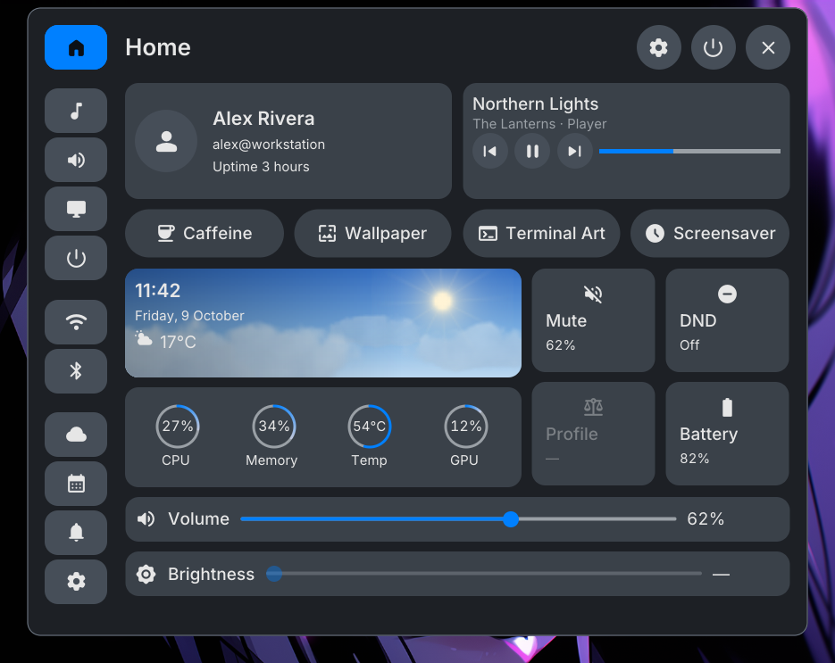

<p align="center">
  <picture>
    <source media="(prefers-color-scheme: dark)" srcset="assets/logo.png">
    
  </picture>
</p>

https://github.com/user-attachments/assets/7cadf7b9-6fe5-4d53-b7d6-757e4082b68a

Guided installer for the SYSC desktop on [Niri](https://github.com/YaLTeR/niri).
Choose your desktop defaults, review existing bars and notification daemons,
then install the suite into your user account.

[Documentation](https://nomadcxx.github.io/sysc/docs/) · [Install](#install) · [Wizard guide](#wizard-guide) · [Sudo and install locations](#sudo-and-install-locations) · [Uninstall](#uninstall) · [Troubleshooting](#troubleshooting)

## What you get

<table>
  <tr>
    <td align="center" valign="top"><a href="https://github.com/Nomadcxx/sysc-shell"></a><br><b><a href="https://github.com/Nomadcxx/sysc-shell">sysc-shell</a></b><br><sub>Bars, panels, launcher and settings</sub></td>
    <td align="center" valign="top"><a href="https://github.com/Nomadcxx/sysc-lock"></a><br><b><a href="https://github.com/Nomadcxx/sysc-lock">sysc-lock</a></b><br><sub>Compositor-enforced lock screen</sub></td>
    <td align="center" valign="top"><a href="https://github.com/Nomadcxx/sysc-terminal"></a><br><b><a href="https://github.com/Nomadcxx/sysc-terminal">sysc-terminal</a></b><br><sub>Live terminal-art wallpaper</sub></td>
  </tr>
</table>

Plus notifications ([sysc-notify](https://github.com/Nomadcxx/sysc-notify)), clipboard history
([sysc-clipboard](https://github.com/Nomadcxx/sysc-clipboard)), a system tray
([sysc-tray](https://github.com/Nomadcxx/sysc-tray)). Choose extras from the shell's
[official plugin catalog](https://github.com/Nomadcxx/sysc-plugins) after setup.
Screenshots use fixture data.

## Before you start

- Use an **Arch-family Linux system on x86_64/amd64**. The current suite
  rejects other distros and architectures, even though we publish an arm64
  installer binary.
- Have Niri configured at `~/.config/niri/config.kdl` and systemd user services
  available. Run the installer from a Niri session for immediate startup.
  Start Niri with `niri-session` so its systemd session target is active.
- Use a terminal of at least **80 × 24** and have internet access for downloads
  and weather lookup.
- Have `yay` or `paru` available if you want the installer to add gSlapper.
  Without either helper, it skips gSlapper and continues with the suite.

**Run as your normal user. Do not prefix the installer with `sudo`.**
The installer requests package-manager privileges when needed.

## Install

Use the guided installer for your first setup, or the AUR if you want pacman to
manage the desktop. Start with sysc-shell; its companions come with it.

### Guided Go installer: no Go required (recommended)

Download the [latest release](https://github.com/Nomadcxx/sysc/releases/latest),
verify its checksum, and keep the installer for future reruns or uninstall:

```sh
download_dir=$(mktemp -d)
curl -fsSL https://github.com/Nomadcxx/sysc/releases/latest/download/sysc-linux-amd64 -o "$download_dir/sysc-linux-amd64" &&
curl -fsSL https://github.com/Nomadcxx/sysc/releases/latest/download/SHA256SUMS -o "$download_dir/SHA256SUMS" &&
(cd "$download_dir" && sha256sum -c --ignore-missing SHA256SUMS) &&
mkdir -p "$HOME/.local/bin" &&
install -m 755 "$download_dir/sysc-linux-amd64" "$HOME/.local/bin/sysc" &&
"$HOME/.local/bin/sysc"
```

Only continue after the checksum reports `sysc-linux-amd64: OK`. To choose a
specific release, replace `latest/download` in both URLs with
`download/v0.1.1`. Add `~/.local/bin` to your `PATH` to use `sysc` directly;
the commands below use its full path.

The published v0.1.1 binary predates the current source improvements. It does
not install sysc-terminal, and its Weather/Media plugin choices do not install
those plugins. Use the shell's catalog to add plugins. The source route below
includes terminal wallpapers, seeds tray presentation for a new config, and
skips the empty plugin-selection page. It also protects existing files during
upgrades and keeps failed uninstall steps available for retry.

### AUR: package-managed desktop

On Arch, install [sysc-shell](https://aur.archlinux.org/packages/sysc-shell).
Your AUR helper pulls in the required companions. Stop existing bars and
notification daemons before starting the shell:

```sh
yay -S sysc-shell
systemctl --user enable --now sysc-shell.service
```

Run the service command inside a Niri session started with `niri-session`.
The shell package pulls in sysc-lock, sysc-clipboard, sysc-notify and sysc-tray,
and its user service starts the companions before the shell. On first start,
it creates a missing config with sysc-lock selected and tray presentation enabled.
Use your AUR helper for subsequent updates.

Add extras when you want them:

| Package | Purpose |
|---|---|
| `sysc-terminal` | Live terminal-art wallpapers |
| `sysc-plugins-git` | The official plugin collection; you can also choose plugins in the shell's catalog |
| `sysc-launch` | Standalone launcher CLI; the shell already includes its launcher |

For wallpapers and the plugin collection: `yay -S sysc-terminal sysc-plugins-git`.
The [installation guide](https://nomadcxx.github.io/sysc/docs/start/install/)
explains the required companions and optional wallpaper tools.

For migration from the guided installer, review user units and binaries that
shadow the packaged files. See the [setup and migration guide](https://nomadcxx.github.io/sysc/docs/)
and `/usr/share/doc/sysc-shell/first-run.md`.

### Source one-liner: requires Go 1.26+ and git

```sh
curl -fsSL https://raw.githubusercontent.com/Nomadcxx/sysc/main/.install | sh
```

This builds current `main` in a temporary directory, opens the wizard when a
terminal is available, and removes the temporary build afterward. It does not
keep a `sysc` installer command. Without a terminal, it uses `--yes`.

### Manual source checkout

For a source checkout you can keep and rerun:

```sh
git clone https://github.com/Nomadcxx/sysc.git
cd sysc
go build -p 2 -o sysc ./cmd/sysc
./sysc
```

## Wizard guide

Each page includes advice for the current choice. Use **Enter** to continue
and **Esc** to return to the previous page.

| Page | What to do |
|---|---|
| Theme | Use **↑/↓** to choose Standard, Compact, or Expressive. Use **←/→** for the desktop's light/dark mode. The installer stays pure black in either mode. |
| Wallpaper | Type a directory such as `~/Pictures/wallpapers`, then press **Enter**. Use an absolute path or a path beginning with `~/`. |
| Plugins | Current source skips this page. Add extras later through the shell's plugin catalog. The released v0.1.1 binary still shows Weather/Media choices, but does not install them. |
| Weather | Check the automatic location or type a city and press **Enter** to search. Once the location is correct, press **Enter** with the input empty to accept it. This configures the built-in weather widget. |
| Conflicts | When another provider is detected, use **↑/↓** to select it and **←/→** to choose how to handle it. See [conflict choices](#conflict-choices). |
| Review | Check the component list, paths, and package-manager advice. Press **Enter** to begin installation. |

**PgUp/PgDn** scrolls long pages, task results, and warnings. **F9** cycles
English, German, French, and Simplified Chinese. **Ctrl+C** quits; **q** also
quits outside text-entry pages. Set `SYSC_REDUCED_MOTION=1` for a static banner.

If you already have a shell configuration, the installer preserves it. Wizard
defaults apply when creating a new configuration.

### Conflict choices

The installer detects providers such as mako, dunst, swaync, fnott, Waybar,
Noctalia, Quickshell shells, and DMS.

| Choice | Effect |
|---|---|
| Hand over | Stop the existing provider, disable its user unit where present, and comment its Niri startup lines so SYSC can take over. |
| Keep both | Leave the existing provider enabled. Review warnings about duplicate bars or competing notification daemons. |
| Skip SYSC component | Leave the corresponding SYSC service disabled and stopped. Its binary still downloads with the suite. |

Uninstall restores recorded startup lines and previously enabled units, plus
any notification activation file the installer displaced.

## Sudo and install locations

The suite runs as your user. gSlapper is a system package, so its package
manager may request your sudo password. The wizard hands over the terminal
for that prompt and resumes afterward. On Arch, yay/paru builds as your user
and elevates its package-manager step.

If gSlapper is already available on `PATH`, the installer leaves it alone.
If its package install fails or no compatible installer is available, the
result lists gSlapper as skipped; the rest of the suite can still install.
`--yes` skips the wizard but does not bypass sudo authentication.

| Location | Contents |
|---|---|
| `~/.local/bin` | Suite executables |
| `~/.config/systemd/user` | User service units |
| `~/.config/sysc-shell/config.json` | Desktop configuration; preserved if it exists |
| `~/.config/niri/sysc.kdl` | SYSC startup configuration included from Niri's config |
| `~/.local/state/sysc` | Install stamp and staging files; guided installer log |

Config, state, and data paths follow absolute `XDG_CONFIG_HOME`,
`XDG_STATE_HOME`, and `XDG_DATA_HOME` overrides. Binaries stay in `~/.local/bin`.

## What the installer installs

The current source [suite pin](internal/pin/pin.json) records component versions
and checksums. The published `v0.1.1` installer includes the services below;
current source also installs sysc-terminal:

| Component | Version | Role |
|---|---|---|
| [sysc-shell](https://github.com/Nomadcxx/sysc-shell) | v0.1.0 | Desktop bar, panels, and plugins |
| [sysc-clipboard](https://github.com/Nomadcxx/sysc-clipboard) | v0.1.2 | Clipboard history |
| [sysc-walls](https://github.com/Nomadcxx/sysc-walls) | v1.0.2 | Idle screensaver |
| [sysc-notify](https://github.com/Nomadcxx/sysc-notify) | v0.1.0 | Notifications |
| [sysc-tray](https://github.com/Nomadcxx/sysc-tray) | v0.1.1 | StatusNotifierItem tray |
| [sysc-lock](https://github.com/Nomadcxx/sysc-lock) | v0.1.0 | Session lock owner |
| [sysc-terminal](https://github.com/Nomadcxx/sysc-terminal) | v0.1.0, current source only | Terminal-art wallpaper, managed by the shell |
| [gSlapper](https://github.com/Nomadcxx/gSlapper) | External package | Video wallpaper; install only when missing |

sysc-terminal needs no standalone user service: the shell starts one process
per output. sysc-greet is a separate greeter project.

The installer enables `sysc-lock-session.service`. Starting the service does
not lock your screen. The installer makes `sysc-lock` the shell's locker, in a
new shell config or an existing one that names no locker, and sets it to lock
after 5 minutes idle unless sysc-walls is installed too (the screensaver then
keeps idle; Settings → When idle switches between them). A locker you already
chose is left alone.

### Distro support

The complete suite currently supports Arch-family systems only. The gSlapper
package code also has checksum-pinned routes for Debian 13, Ubuntu 24.04,
Ubuntu 25.x, and Fedora 42+, using apt-get or dnf. Those routes prepare for
future suite support; they do not enable installation on those distros today.

| Platform | Status |
|---|---|
| Arch-family, x86_64 | Supported |
| AUR packages | Published. Start with `sysc-shell`; your helper installs its dependencies. |
| Debian / Ubuntu | Full suite support planned. Only the gSlapper package route exists today. |
| Fedora | Full suite support planned. Only the gSlapper package route exists today. |
| Other distributions and architectures | Not supported. The installer refuses to run. |

## Command-line installation

Skip the wizard and choose a weather city:

```sh
"$HOME/.local/bin/sysc" --yes --city "Melbourne"
```

Or supply both coordinates:

```sh
"$HOME/.local/bin/sysc" --yes --lat=-37.8136 --lon=144.9631
```

| Flag | Use |
|---|---|
| `--yes` | Use Standard, dark mode, and `~/Pictures/wallpapers`. Without location flags, attempt a public-IP weather lookup. Add plugins later through the shell's catalog. |
| `--city "Berlin"` | Look up a weather city; requires network access. |
| `--lat=… --lon=…` | Supply both weather coordinates without a location lookup. |
| `--lang en` | Choose `en`, `de`, `fr`, or `zh-Hans`. |
| `--keep-conflicts` | Keep existing providers. |
| `--handover=all` | Hand over detected notification, bar, and shell providers. |

By default, `--yes` hands over notification daemons and keeps bars and shells,
with warnings for kept conflicts. `--keep-conflicts` and `--handover=all` are
mutually exclusive. In a source checkout, substitute `./sysc` for the path.

## Uninstall

Remove suite binaries and user units, restore recorded handovers, and keep
your shell configuration:

```sh
"$HOME/.local/bin/sysc" uninstall
```

Add `--purge` to also remove the `sysc-shell` configuration directory.
Add `--remove-gslapper` to remove gSlapper **only if SYSC installed it**; its
package manager may request sudo. Add `--yes` to skip the uninstall confirmation.

If you used the source checkout, run `./sysc uninstall` there. If you used only
the source one-liner, build a source checkout for uninstall too. Keep the
installer that matches your installation; the published v0.1.1 binary predates
the current source's ownership checks.

## Troubleshooting

| Symptom | Next step |
|---|---|
| Root, distro, or architecture refusal | Run as your normal user on an Arch-family x86_64 system. Other suite targets are not enabled yet. |
| Missing Niri configuration | Configure Niri first and ensure `~/.config/niri/config.kdl` exists, accounting for your XDG config override. |
| Weather lookup fails | Retry a city search; for command-line installs, supply both `--lat` and `--lon`. |
| gSlapper is skipped | Read its task reason. Install yay/paru if missing, or resolve the package error and rerun. |
| Services enabled but not started | From SSH/TTY, log into Niri. If the installer reports an inactive session target, start Niri with `niri-session` and rerun. |
| A guided install fails | Read the final task results and `~/.local/state/sysc/installer.log`, or the corresponding XDG state path. |

To inspect the desktop shell service:

```sh
systemctl --user status sysc-shell.service
journalctl --user -u sysc-shell.service -b
```
