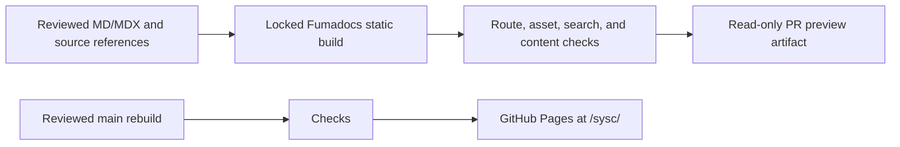

# SYSC Documentation Site Design

> Status: Approved for design planning on 2026-10-09. Site implementation and publication require a later instruction.

This design pairs with the [research and implementation handover](2026-10-09-sysc-documentation-site-handover.md), which holds the source inventory, detailed route list, and implementation acceptance criteria.

## Goal and readers

Build one instructional site for installing, configuring, recovering, developing, and extending the SYSC desktop. Serve first-time installers, existing desktop users, component developers, and plugin authors. Component maintainers keep authority over implementation and releases; the site explains how current behavior fits together.

Store the site in `Nomadcxx/sysc/docs-site/`. Reuse sysc-greet's Next.js/Fumadocs static export and target GitHub Pages under `/sysc/`. Start with one edition for the current SYSC suite. Add an archive when another supported suite needs separate instructions.

## Home and navigation

The home page is a short action hub with five clear routes: install SYSC, configure the desktop, troubleshoot a problem, develop with the components, and author a plugin. It includes a compact component directory and a prominent compatibility link. Search works across the full site from every page.

The sidebar has five top-level sections:

| Section | Main content |
|---|---|
| Start | Requirements, install, wizard, verification, and compatibility facts needed before installation. |
| Guides | Conflicts, upgrade, uninstall, themes, wallpapers, Niri session setup, and recovery. |
| Components | The eleven requested non-plugin projects, with role-specific overviews and relevant guides. |
| Developers | Architecture, builds, interfaces, releases, and documentation workflow. |
| Plugins | User catalog guidance and the authoring, validation, publishing, and submission journey. |

Cover `sysc-plugins` under Plugins. Add integration guidance for `sysc-notify` and gSlapper so the suite installation path is complete, and link to sysc-Go as a dependency reference. Keep full standalone manuals for those three out of scope.

## Page patterns and content rules

Procedural pages state prerequisites and effects before commands. Steps identify whether they run as a normal user, a user service, or a system administrator, show expected output, and link to recovery or removal instructions. Troubleshooting starts with read-only diagnostics; commands that replace configuration, restart a login service, clear data, or acquire a lock explain that effect beside the command.

Each component overview names its role and links to shared install, configuration, and recovery guides. Show a compact support/version summary. Maintain a linked sources table with repository, current default-branch commit, relevant release tag, and review date. Put full commit IDs in that table; use project names in search titles so common terms such as “install” and “theme” remain distinguishable.

Base component guidance on each current default branch and update it when behavior changes. Install instructions name the exact component release pinned by the SYSC installer release they describe. This lets readers see both current implementation behavior and what a released installer installs. Update the sources table with the docs; component maintainers keep their release process. Mark unknown support and qualification facts as unknown.

The compatibility reference distinguishes a supported installer route, an available release asset, and a configuration that has been qualified. It also records architecture, distro, compositor/protocol, service manager, runtime/build requirements, privilege boundary, and known limits. The suite manifest at the documented SYSC release is the source for installed component versions; it is not duplicated as another lockfile.

## Plugin submission policy

Authors can publish an independent catalog source or propose official inclusion with a pull request to `sysc-plugins`. Explain validator-enforced rules separately from maintainer review. Promise neither acceptance nor a review time. Keep catalog license metadata optional, as the current schema does. Explain the screenshot enforcement gap; label image-size and dimension guidance as manual review until tooling enforces it.

Plugin checksums establish content integrity, not security endorsement. Host capability checks do not sandbox a same-user executable. State these limits in the authoring and review guidance.

## Visual and interaction design

Use a pure black `#000000` canvas with restrained RAMA red/pink accents, readable light text, visible borders, and the existing IBM Plex Sans/Fira Code typography where the reviewed upstream shell provides them. Validate contrast against actual surfaces. Keep the home static and remove the animated ticker.

On desktop, show the compact left sidebar, a centered article column, and an optional right table of contents. Put search in the header. On mobile, make the sidebar a keyboard-operable drawer and collapse the table of contents. Keep code and tables inside the viewport with deliberate overflow behavior.

Keep search, menus, article links, and code-copy controls keyboard-accessible. Show focus, honor reduced-motion preferences, and preserve content at high zoom. Review the export at desktop and mobile widths, at 200% zoom, and with keyboard-only navigation.

## Technical architecture and trust boundary

Store MD/MDX under `docs-site/content/docs/`, with Fumadocs navigation metadata and the existing site shell. Export static files with Next.js and bundle Orama search data. Set `DOCS_BASE_PATH` to an empty value for local root-path preview and `/sysc` for GitHub Pages. Keep the site free of an application server, database, hosted search API, and new preview service.

Run PR builds with read-only permissions and no deployment secrets. Upload a downloadable preview artifact. Rebuild reviewed `main` in a separate production job and scope Pages permissions to that job. Keep PR artifacts out of privileged deployment workflows. Do not fetch or execute plugin assets or run application installation commands during documentation builds.

## Approval and maintenance boundaries

This document approves the site design and implementation direction. Request a later instruction before configuring Pages, publishing the site, migrating greet URLs, or changing component applications. Keep the existing greet site available and cross-link first. Consider redirects after the new routes pass review.

The owner assigns a site maintainer and component reviewers before transferring publication responsibility. Do not invent names. At implementation time, record the source revisions used and distinguish current source from suite-pinned releases. When component behavior changes, update the relevant site guidance in the same change or a linked documentation change.

Submit the implementation for owner review after the requested project routes and user journeys have substantive content, compatibility and privilege claims match their sources, search and local assets work under `/sysc`, accessibility review is complete, and PR/production permissions preserve the trust boundary.
